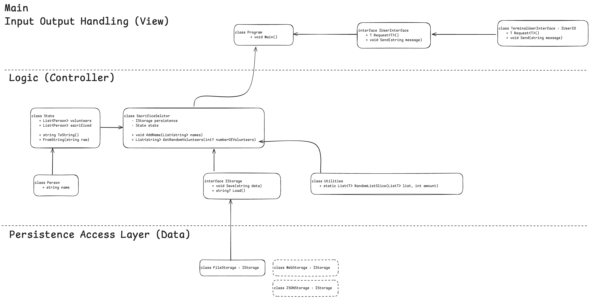

# Sacrifice Selector

A simple CLI for randomly selecting a set of persons with a persistence layer.
It's more complex than, strictly speaking, needed, and is more to showcase how
larger programs are constructed from a set of smaller objects. Written in C#.

The way we persist the data here using just strings are less than ideal, but it's simple, in a production environment you would likely use a Database.

Feel free to play around with the project—add more patterns, refactor parts, or improve the persistence layer (maybe switch to JSON or a database?).

> [!INFO]
> The code is rather heavily commented which can make it hard to follow the flow of logic.
> I have added a recommended extension to the project which allows you to hide/unhide them.
> Install this in VS Code and you can toggle comments on/off by running:<br>
> Windows: `Ctrl + Shift + P` > Hide Comments
> iOS: `Command + Shift + P` > Hide Comments

## To run

- From source (run the app directly without creating a binary):

  - Add names to the list of potential sacrifices:

    ```shell
    dotnet run -- --add-names
    ```

  - Pick random sacrifices from the saved names:

    ```shell
    dotnet run -- <number of sacrifices (default 2)>
    ```

- Built binary (compile the app into an executable):

  1. Create an executable for distribution:

     ```shell
     dotnet publish --configuration Release --output out
     ```

  2. Run the compiled program:

     ```shell
     ./out/random-selector --add-names
     ```

## Overview



The diagram above shows the relationships between classes, illustrating how they communicate with each other while maintaining separation of concerns.

## Patterns in use

### [Dependency Injection (DI)](https://en.wikipedia.org/wiki/Dependency_injection)

- **Description:**

  Dependency Injection is a design pattern where objects are provided with their dependencies rather than creating them internally. This decouples the creation and use of objects, allowing for more flexible and testable code.

- **Usage in the Project:**

  The `IStorage` and `IUserInterface` interfaces are injected into the `SacrificeSelector` and `Program` classes, allowing different implementations of storage and user interaction without changing the core logic.

- **Common Use Cases:**

  Used in large systems to inject services (e.g., database connections, logging, or user interfaces) to decouple implementations from the main business logic.

### [Interface Segregation](https://en.wikipedia.org/wiki/Interface_segregation_principle)

- **Description:**

  The Interface Segregation Principle involves splitting larger interfaces into smaller, more focused ones. This ensures that classes implementing interfaces only depend on the methods they need.

- **Usage in the Project:**

  The `IStorage` and `IUserInterface` interfaces define only the methods relevant to their role, keeping the responsibilities of interacting with storage and the user separate and focused.

- **Common Use Cases:**

  Used in systems to ensure that different parts of a program are only exposed to the methods they need, reducing unnecessary dependencies.

### [Single Responsibility Principle (SRP)](https://en.wikipedia.org/wiki/Single-responsibility_principle)

- **Description:**

  Each class or module should have one, and only one, reason to change. This promotes highly cohesive and focused classes that are easier to maintain and understand.

- **Usage in the Project:**

  Each class in the project has a clear responsibility: `SacrificeSelector` handles volunteer selection, `TextFileStorage` handles file I/O, `State` manages data, and `Person` encapsulates volunteer details.

- **Common Use Cases:**

  This principle is foundational in object-oriented programming and is used to keep classes focused on a single task or functionality.

### [Encapsulation](<https://en.wikipedia.org/wiki/Encapsulation_(computer_programming)>)

- **Description:**

  Encapsulation is the practice of restricting access to an object's internal state and exposing behavior through methods or properties. It protects the integrity of the object's state.

- **Usage in the Project:**

  The `Person` class encapsulates the _Name_ property, and the `State` class manages internal lists of _volunteers_ and _sacrifices_, ensuring that modifications occur in controlled ways.

- **Common Use Cases:**

  Encapsulation is used in most object-oriented systems to ensure that objects maintain valid state and behavior, reducing bugs and side effects.

### [Exception Handling](https://en.wikipedia.org/wiki/Exception_handling)

- **Description:**

  Exception Handling is not a design pattern in itself but a crucial practice for dealing with runtime errors. Well-structured exception handling ensures that systems can handle failures gracefully and continue functioning when possible.

- **Usage in the Project:**

  The _Save_ and _Load_ methods in `TextFileStorage` and other parts of the project use try-catch blocks to handle file I/O errors and other exceptions, providing useful error messages while ensuring program stability.

- **Common Use Cases:**

  Used throughout all robust systems to manage unexpected conditions, ensuring that the application can recover from errors or report them effectively.
